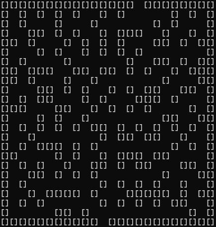

<h1 align="center">Maze Generator</h1>
<div align="center"></div>
<br/>
<h2>About</h2>

The maze generator project was a bonus assignment developed as part of Advanced Data Structures and Algorithms. It is a program deisgned to generate and visualize mazes using the Iterative randomized Prim's algorithm.

<h2>Goal and requirements</h2>

The assignment was to create a random maze generator untilizing any algorithm and two or more data stuctures. 

<h2>Key learnings</h2>

- Algorithm Implementation 
- Data Structures
- Problem Solving and Logic 

<h2>Usage</h2>

1. Download this project as zip and extract it
2. Run  ```
      java Maze 
              ``` in the command line
3. Open maze.txt to view the generated maze


<h2>Credits</h2>

- Author: Jayden tarrance

<h2>Copyright</h2>
This project is licensed under the terms of the MIT license and protected by Udacity Honor Code and Community Code of Conduct. See <a href="LICENSE.md">license</a> and <a href="LICENSE.DISCLAIMER.md">disclaimer</a>.
